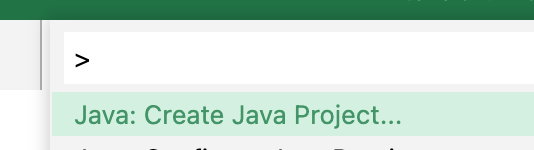

# VSCode 中创建一个 Maven 项目

## 步骤
* 安装 VSCode 插件 Java [插件](https://code.visualstudio.com/docs/java/java-project)
* Ctrl / Command (Mac) + Shift + P, 选择 Java: Create Java Project... -> Maven -> maven-archetype-quickstart

* 根据提示输入 groupid 和 artifactid