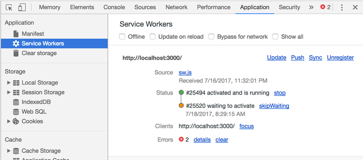

# [渐进式 Web 应用 ( PWA, Progressive Web APP )](https://web.dev/progressive-web-apps/)

* ## PWA 具有下面一些特性

    * 渐进式 - 适用于所有浏览器，因为它是以渐进式增强作为宗旨开发的
    * 连接无关性 - 能够借助 Service Worker 在离线或者网络较差的情况下正常访问
    * 类似应用 - 由于是在 App Shell 模型基础上开发，因为应具有 Native App 的交互和导航，给用户 Native App 的体验
    * 持续更新 - 始终是最新的，无版本和更新问题
    * 安全 - 通过 HTTPS 协议提供服务，防止窥探和确保内容不被篡改
    * 可索引 - 应用清单文件和 Service Worker 可以让搜索引擎索引到，从而将其识别为『应用』
    * 粘性 - 通过推送离线通知等，可以让用户回流
    * 可安装 - 用户可以添加常用的 webapp 到桌面，免去去应用商店下载的麻烦
    * 可链接 - 通过链接即可分享内容，无需下载安装
    * PWA vs 原生应用
    
        

* ## App Manifest


* ## [Service Worker](https://developers.google.cn/web/fundamentals/primers/service-workers)
    
    > 控制所有所注册浏览器向 `http://www.example.com` 站点发起的请求。只需要监听 **fetch** 事件，就可以任意的操纵请求，可以返回从 **CacheStorage** 中读的数据，也可以通过 **Fetch API** 发起新的请求，甚至可以 new 一个 Response，返回给页面。所以如果误用 Service Worker, 有些页面资源可能就不会及时正确地更新。

    * 关键字: **离线**    

    * 功能和特性：
    
        * 在网页已经关闭的情况下还可以运行, 用来实现页面的缓存和离线, 后台通知等等功能。
        * 可编程拦截代理请求和返回，缓存文件，缓存的文件可以被网页进程取到（包括网络离线状态）
        * 一个独立的 worker 线程，独立于当前网页进程，有自己独立的 worker context。
        * 一旦被 install，就永远存在，除非被手动 unregister
        * 用到的时候可以直接唤醒，不用的时候自动睡眠
        * 离线内容开发者可控
        * 能向客户端推送消息
        * 不能直接操作 DOM
        * 必须在 HTTPS 环境下才能工作
        * 异步实现，内部大都是通过 [Promise](https://www.yuque.com/ostwind/es6/docs-promise) 实现
    
    * 注册一个 Service Worker 举例
        
        通常以下注册代码

        ```javascript
        if (navigator.serviceWorker) {  
          // 告知浏览器从哪里能找到指定的 Service Worker。
          // 浏览器会找到 /sw.js 文件，然后保存在当前被访问的域名的名下。
          // 该文件包含各类事件的处理逻辑，整体定义 Service Worker 的行为。
          navigator.serviceWorker.register('/sw.js')
            .then(registration => {
              console.log('恭喜。作用范围: ', registration.scope);
            })
            .catch(error => {
              console.log('抱歉', error);
            });
        }
        ```
        文件路径 /sw.js 表明默认情况下 SW 的作用范围是你的 url 的根目录（比如 http://localhost:3000/ ）。
         
        SW 里能通过监听事件获知所有在 url 根目录里发生的请求。
         
        一个如 /js/sw.js 这样的路径只会捕获到 http://localhost:3000/js 下的请求。
        
        可以显式地定义SW的作用范围（ register 函数传第二个参数 ），**只能向下不能向上**指定
        ```javascript
        // 把根目录的 sw.js 作用范围向下指向子目录 /js/ 
        navigator.serviceWorker.register('/sw.js', { scope: '/js' })
        ```

    * 在 Chrome 中查看 Service Worker 信息
        
            

    * 内建变量:

        * **self**: 表示 Service Worker 作用域, 也是全局变量
        * **caches**: 表示浏览器缓存管理, 全局 [CacheStorage](https://developer.mozilla.org/zh-CN/docs/Web/API/CacheStorage) 对象
        * **skipWaiting**: 表示强制当前处在 waiting 状态的脚本进入 activate 状态
        * **clients**: 表示 Service Worker 接管的页面

    * 一个 Service Worker 简单完整的例子

        **事件**
        * **install**: 
            * Service Worker 首次注册或 SW 文件（/sw.js）发生变化的时候触发（浏览器会自动鉴别是否发生改变）install 事件
            * 本事件响应函数中编写 SW 初始化逻辑，或者通过只执行一次的命令来设定 SW 初始状态。一种常见的用法是在安装阶段准备好缓存。
        * **activate**: 激活时触发 activate 事件，可以在升级 SW 文件的时候针对之前的版本执行清理或其他维护操作。
            > 当实际的网页关掉并重新打开时，浏览器会将原先的 Service Worker 替换成新的，然后在 install 事件之后触发 activate 事件。如果需要清理缓存或者针对原来的 SW 执行维护性操作，activate 事件就是做这些事情的绝佳时机。
            
                        

        * **fetch**: 在 SW 注册好以后，“拦截”并处理整个 SW 控制站点的所有请求，并决定想要返回什么——是缓存的数据还是一个实际网络请求的结果。
        * **sync**: 可以将网络相关任务延迟到用户有网络的时候再执行。这个功能常被称作“背景同步”。
            > 这功能可以用于保证任何用户在离线的时候所产生对于网络有依赖的操作，最终可以在网络再次可用的时候抵达它们的目标。
            
            与其他事件先比，响应 sync 事件需要事先注册一个同步事件，同时在 SW 里实现 sync 事件监听处理。 
            
            **任何需要确保在有网络时立刻执行或者等到有网再执行的操作，都需要注册为一个sync事件**。            

            ```javascript
            // “背景同步”举例
            navigator.serviceWorker.ready  
              .then(registration => {
                // click 是一个同步事件
                document.getElementById('submit').addEventListener('click', () => {
                  // submit 参数 'submit' 对应下文举例的 event.tag，以区分不同的背景同步事件响应  
                  registration.sync.register('submit').then(() => {
                    console.log('sync registered!');
                  });
                });
              });
            ```
        
            
        
        * Parsed: 注册完成, 脚本解析成功, 尚未安装
        * Installing: 对应 Service Worker 脚本 install 事件执行, 如果事件里有 event.waitUntil() 则会等待传入的 Promise 完成才会成功
        * Installed(waiting): 页面被旧的 Service Worker 脚本控制, 所以当前的脚本尚未激活。可以通过 self.skipWaiting() 激活新的 Service Worker
        * Activating: 对应 Service Worker 脚本 activate 事件执行, 如果事件里有 event.waitUntil() 则会等待这个 Promise 完成才会成功。这时可以调用 Clients.claim() 接管页面
        * Activated: 激活成功, 可以处理 fetch, message 等事件
        * Redundant: 安装失败, 或者激活失败, 或者被新的 Service Worker 替代掉    
        
            > Service Worker 从注册开始需要先 install, 如果 install 成功, 接下来需要 activate, 然后才能接管页面。但是如果页面被先前的 Service Worker 控制着, 那么它会停留在 installed(waiting) 这个阶段等到页面重新打开才会接管页面, 或者可以通过调用 self.**skipWaiting**() 方法跳过等待。

        **举例模板**

        ```javascript
        var cacheStorageKey = 'cachesName';
        var cacheList = [
          // 注册成功后要立即缓存的资源列表
        ]
        
        /*
            所有站点 SW 的 install 和 activate 都差不多，无非是做预缓存资源列表，更新后缓存清理的工作，逻辑不应该太复杂
        */

       // 当浏览器解析完 SW 文件时触发 install 事件
        self.addEventListener('install', event => {
          // install 事件中一般会将 cacheList 中要缓存的内容通过 addAll 方法，请求一遍放入 caches 中
          event.waitUntil(
            // 通过 open 获取一个可操作的 Cache 对象
            // 处理静态缓存
            caches.open(cacheStorageKey).then(cache => cache.addAll(cacheList))
          );
        });
        
        // 激活时触发 activate 事件
        self.addEventListener('activate', event => {
          // active 事件中通常做一些过期资源释放的工作，匹配到就从 caches 中删除
          var cacheDeletePromises = caches.keys().then(cacheNames => {
            return Promise.all(cacheNames.map(name => {
              if (name !== cacheStorageKey) {
                return caches.delete(name);
              } else {
                return Promise.resolve();
              }
            }));
          });
        
          event.waitUntil(
            Promise.all([cacheDeletePromises])
          );
        });
        
        // 在 SW 注册好以后，处理整个 SW 控制站点的所有请求
        // 通常包含复杂的缓存逻辑
        self.addEventListener('fetch', event => {
          // 在此编写缓存策略
          event.respondWith(
            // 处理动态缓存
            // 可以通过匹配缓存中的资源返回
            caches.match(event.request)
            // 也可以从远端拉取
            // request 存在于一个 FetchEvent 对象，包含请求的详情
            fetch(event.request.url)
            // 也可以自己造
            new Response('Do your defined jobs!')
            // 也可以通过吧 fetch 拿到的响应通过 caches.put 方法放进 caches
          );
        });
        
        // 响应上文注册的“背景同步”        
        self.addEventListener('sync', event => {  
          // event.tag 对应上文中 registration.sync.register 的字面量参数，
          // 以区分不同的背景同步事件响应   
          if (event.tag === 'submit') {
            console.log('sync!');
          }
        });
        
        ```    

    * [Workbox](https://developers.google.cn/web/tools/workbox/guides/get-started)
        >  Workbox 是 PWA 相关的工具集合，也是 Google 官方的 PWA 框架。
        > 
        > Workbox 解决的就是用底层 API 写 PWA 太过复杂的问题。这里说的底层 API 包含去监听 install、activate、 fetch 事件做相应逻辑处理等。
        
        Workbox 一些参考缓存策略建议
        
        * **HTML**，如果需要页面离线可以访问，使用 NetworkFirst，如果不需要离线访问，使用 NetworkOnly，其他策略均不建议对 HTML 使用。
        
        * **CSS 和 JS**，
            * 如果 CSS，JS 都在 **CDN** 上，SW 并没有办法判断从 CDN 上请求下来的资源是否正确（HTTP 200），如果缓存了失败的结果，问题就大了。这种建议使用 **Stale-While-Revalidate** 策略，既保证了页面速度，即便失败，用户刷新一下就更新了。
        
            * 如果 CSS，JS 与站点在同一个域下，并且文件名中带了 Hash 版本号，那可以直接使用 **Cache First** 策略。
        
        * **图片**建议使用 Cache First，并设置一定的失效事件，请求一次就不会再变动了。
        * 对于**不在同一域下的任何资源**，**绝对不能**使用 **Cache only** 和 **Cache first**。

        常用相关扩展工具
        * workbox-cli
        * gulp-workbox
        * webpack-workbox-plagin

* ## [App Shell](https://developers.google.cn/web/fundamentals/architecture/app-shell)
    > 对于使用包含大量 JavaScript 的架构的单页应用来说，App Shell 是一种常用方法。
    > 
    > App Shell 提供了支持用户界面所需的最小的 HTML、CSS 和 JavaScript

* ## 参考资料
    
    * [MDN PWA 文档](https://developer.mozilla.org/zh-CN/docs/Web/Progressive_web_apps)
    * [PWA 实战](https://lavas-project.github.io/pwa-book/)
    * [Chrome 的 Service Worker 范例](https://github.com/GoogleChrome/samples/tree/gh-pages/service-worker)
    * [知乎 PWA 话题](https://www.zhihu.com/topic/20073560/hot)
    * [Build A PWA With Webpack And Workbox](https://www.smashingmagazine.com/2019/06/pwa-webpack-workbox/)
    * [IIS 服务器配置HTTPS（SSL证书）](https://zhuanlan.zhihu.com/p/60694348)
    * [Win10系统IIS下部署搭建https](https://www.linuxidc.com/Linux/2016-07/133211.htm)